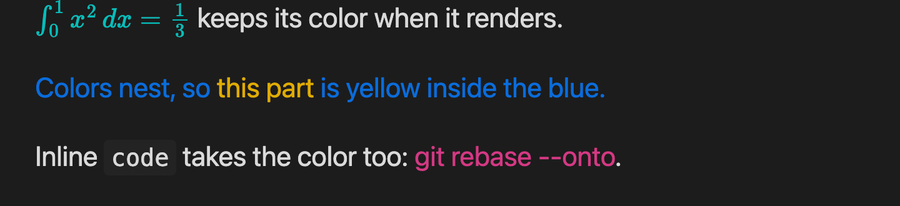
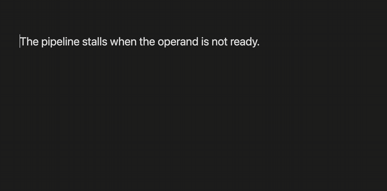
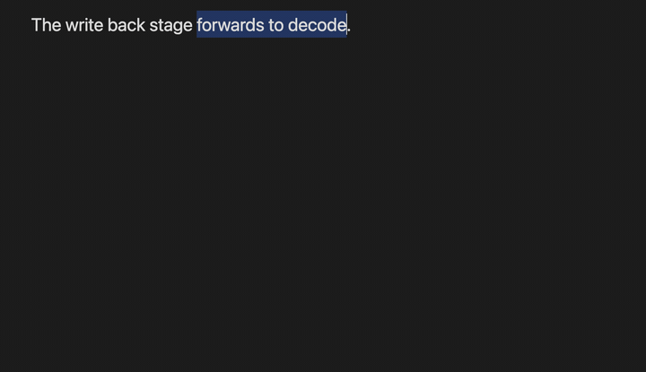
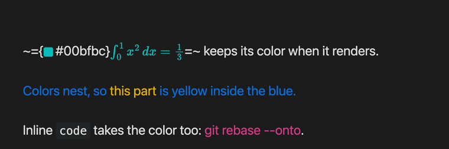
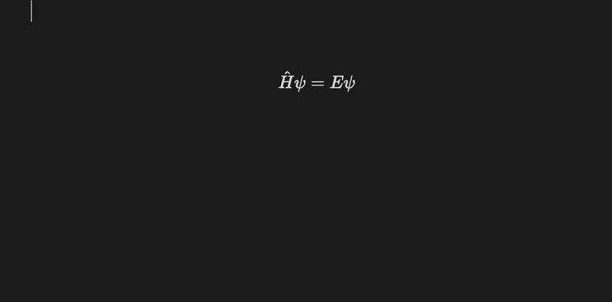
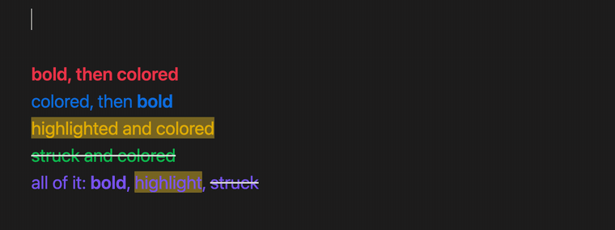
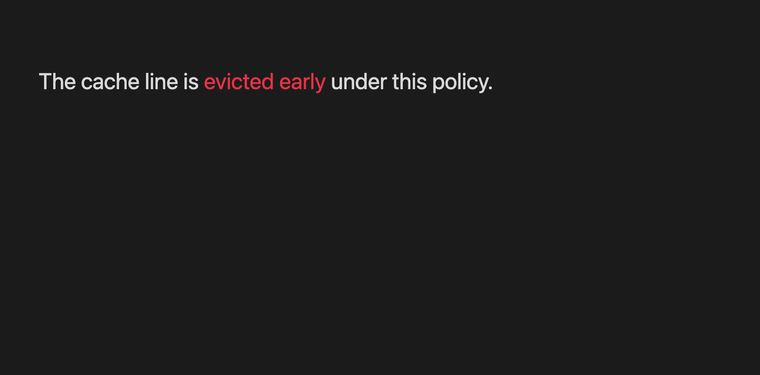
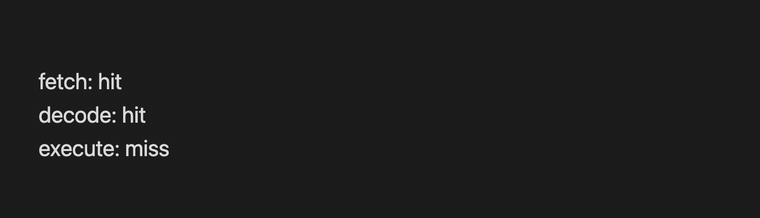
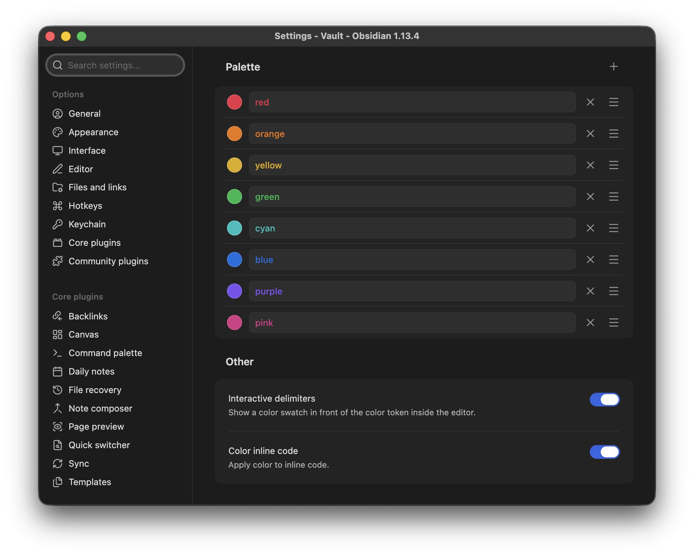

# Colors

Color text in Obsidian with markup that carries the color itself. A note stores a plain hex, so what you wrote is what renders: live preview, reading mode and PDF export all draw the same thing, on any machine, whatever your palette happens to be called.

```
~={#00bfbc}$\int_0^1 x^2\,dx = \tfrac{1}{3}$=~ keeps its color when it renders.
~={#086ddd}Colors nest, so ~={#e0ac00}this part=~ is yellow inside the blue.=~
Inline `code` takes the color too: ~={#d53984}git rebase --onto=~.
```



## Color a selection

Select the text, run **Change text color**, pick from your palette. The note receives the hex, never the name.



Or right click the selection and use the **Color** submenu, which carries the same palette plus **Custom...** and **Remove**. No hotkey to remember, and it is the quickest route when your hands are already on the mouse.



On macOS this submenu is drawn by the system, so it looks like a plain system menu rather than the styled one above. Same entries, same result. Turning off **Native menus** in Obsidian's Appearance settings gives you the styled version.

## It renders the same everywhere

Live preview and reading mode are two different renderers, held to one syntax definition by a conformance test, so a note looks the same in both. Rendered LaTeX inside a colored section included. PDF export inherits the same styles.



## Display math is colored in LaTeX

A `$$` block cannot take the `~={...}=~` markup: one marker in front of the `$$` and reading mode stops seeing a math block at all. So a math block is colored the way LaTeX colors things, with a `\color` command written into the block. Both modes hand the same source to the same engine, and there is nothing left for them to disagree about.



## Bold, highlight, strikethrough

Colors compose with Obsidian's own markup, in either order. Put the color inside the bold or the bold inside the color, mix all three in one line, and both renderers agree with the source mode you typed.

```
**~={#e93147}bold, then colored=~**
~={#086ddd}colored, then **bold**=~
==~={#e0ac00}highlighted and colored=~==
~={#08b94e}~~struck and colored~~=~
~={#7852ee}all of it: **bold**, ==highlight==, ~~struck~~=~
```



The two syntaxes share their characters: `=~` ends with the `~` that `~={` begins with, and `==highlight==` and `~~strikethrough~~` are built from exactly those two. Where they touch, the opening marker wins the character both want, and a closing marker that Obsidian's strikethrough broke in half is put back together. The conformance corpus and `test/postProcessor.test.ts` hold both renderers to that.

## Change a color without retyping it

Put the cursor in a colored section and the hex appears with a swatch in front of it. Hover the swatch for the palette, a custom picker, or **Remove**.



## Every cursor at once

Multiple selections take the color in a single step, and a single undo.



## Syntax

```
~={#ff8800} full hex =~
~={#0f8}    short form =~
~={#ff880080} alpha channel =~
~={red}     a palette name, rewritten to its hex as you finish typing it =~
```

- Colors nest, and the innermost one wins
- A section ends at the closing `=~`, at a blank line, or at the end of the block
- Markup inside a code fence, an inline code span or a `$$` math block is left alone. It is a code sample there, not markup
- A stray `=~` is plain text, not a broken document

## Applying and removing

| Action | Effect |
|---|---|
| **Change text color** | palette suggester |
| **Apply custom color (hex)** | color picker |
| **Apply latest color** | reuses the last color you picked |
| **Remove text color** | strips the markup around the cursor, or every color inside the selection |
| Right click a selection | the same list under **Color** |
| <kbd>Tab</kbd> | jumps out of the colored section the cursor is in |

## Settings



**Palette.** One row per color: the swatch opens a picker, the field next to it holds the name. `+` adds a row, `×` deletes one after a confirmation, the handle on the right reorders (so does alt with the arrow keys). Names are labels for the menus and the suggester only. They never enter a note, so renaming or deleting one leaves every note you have already written exactly as it renders today.

**Interactive delimiters.** Shows a color swatch in front of the token while the cursor is inside a colored section, and gives you the hover menu for swapping or removing the color. Turn it off to see the bare token.

**Color inline code.** When on, inline code inside a colored section takes the color as well. When off, inline code keeps the color your theme gives it.

Both switches and every palette row are reachable from Obsidian's own settings search, because the tab is declared rather than drawn.

## Requirements

Obsidian 1.13 or later, desktop and mobile.

## Installation

Settings, Community plugins, Browse, search for **Colors**, install and enable.

To run a build that is not released yet, use [BRAT](https://github.com/TfTHacker/obsidian42-brat) with this repository's URL, or copy `main.js`, `manifest.json` and `styles.css` from a release into `.obsidian/plugins/colors/`.

## How it works

A lezer grammar parses the coloring syntax alongside Obsidian's own markdown in the editor. Reading mode never sees that source, so it walks the rendered block instead. Two mechanisms are unavoidable, one definition is not: both answer to the same syntax module, and `test/syntaxConformance.test.ts` feeds one corpus through both renderers and fails when they disagree. Colors are applied as a class plus a custom property carrying the hex, so themes and CSS snippets can still override them.

## About this fork

A lean fork of [Fast Text Color](https://github.com/Superschnizel/obsidian-fast-text-color) by Leon Holtmeier. The markup syntax and the lezer grammar carry over. Rendering was rebuilt hex-only, and themes, per-id formatting, keybinds and the floating color menu were removed by design. Notes written with the original `~={id}` markup still render whenever a palette entry carries that name, and editing such a token rewrites it to its hex.

Licensed GPL-3.0, like the original.
